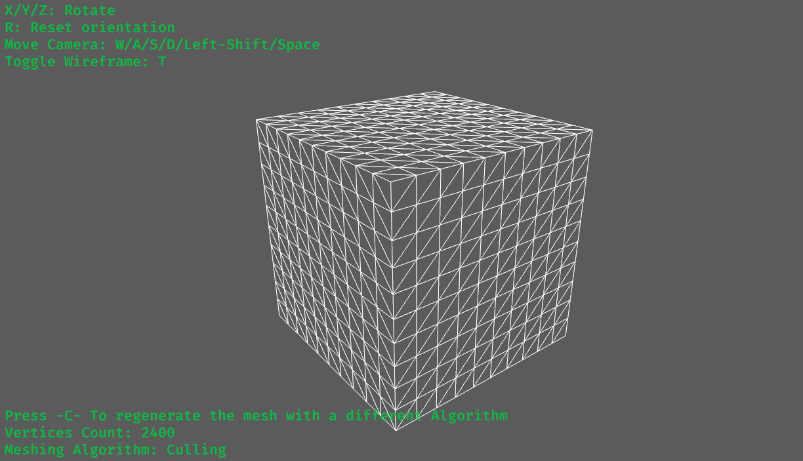

# Bevy Meshem
[Crates.io](https://crates.io/crates/bevy_meshem),
[docs](https://docs.rs/bevy_meshem)

Bevy Compatibility:

| Bevy Version |  bevy_meshem         |
|--------------|----------------------|
| `0.11`       | `0.1.1`               |

Bevy Meshem is a Rust crate designed to provide meshing algorithms for voxel grids, enabling you to create cohesive 3D mesh structures from a grid of cubic voxels.
Similar to the mechanics in Minecraft, Bevy Meshem offers a powerful and flexible way to visualize voxel-based environments with efficient mesh generation.
Currently in pre-release stages of development.

## Features

### Meshing Algorithms: 
Bevy Meshem comes with a collection (currently 2, less is more..? :) of meshing algorithms that allow you to generate complex meshes from voxel data efficiently.

### Seamless Bevy Integration: 
Designed to seamlessly integrate with the Bevy game engine, Bevy Meshem is tailored for use in game development, ensuring easy incorporation into your Bevy-powered projects.

### Performance: 
Bevy Meshem focuses on performance, utilizing Rust's performance benefits to create meshes quickly and efficiently, even for large voxel grids.

## Currently supported meshing algorithms

### "The Naive Method" 
Iterate over the grid and generate a matching cube for each voxel (Also reffered to as the "default" as this method doesn't offer any optimization) examples: (screenshots from examples/simple_example.rs)


10x10x10 grid, each voxel is built out of 24 vertices, and the entire mesh is built out of 24000 (expected, 24 * 10 * 10 * 10)

### "Culling"
A slightly more sophisticated method, while iterating over the grid, we don't add any vertices and indices that are hidden behind other voxels. This is roughly the method that Minecraft uses in its
engine, though the specifics are obviously unknown. examples:


10x10x10 grid, but in contrast to The Naive Method, only 2400 are rendered.

### Not supported: "Greedy Meshing"
Greedy Meshing is even more effecient than Culling, but it makes very limiting compromises, making it somewhat undesirable. Support for this method is likely to be added in later stages.

## Requirements & Installation
- You must be familliar with the Bevy game engine, and of course the Rust programming language.
- You know the drill - add this incantation to your project's Cargo.toml file:
  ```toml
  [dependencies]
  bevy_meshem = "0.1.1"
  ```

## Usage
The example in examples/simple_example.rs shows what you need to do to get started.

## Design Goals
Flexibillity, Stabillity, User experience and Performance.
These values will always come before more features.

## Contributing
Contributions are very welcome! This project is currently in its early stages and operates closely with the Bevy rendering API.
As a result, it may have some stability challenges. However, your contributions can play a significant role in enhancing and stabilizing the project.

## Credits
Thanks to mikollysenko writing this informative article!
https://0fps.net/2012/06/30/meshing-in-a-minecraft-game/
And to the Bevy Community, for building an awesome project!

